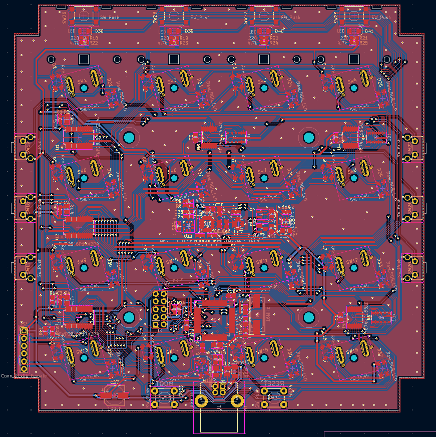
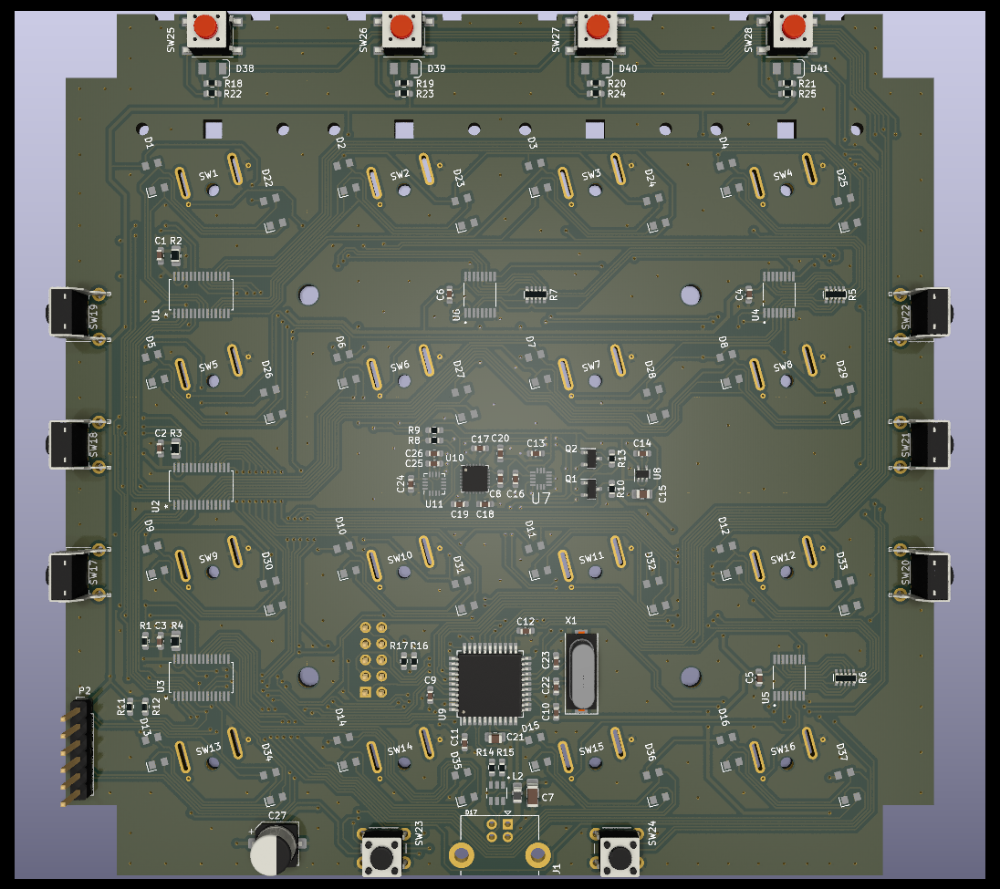
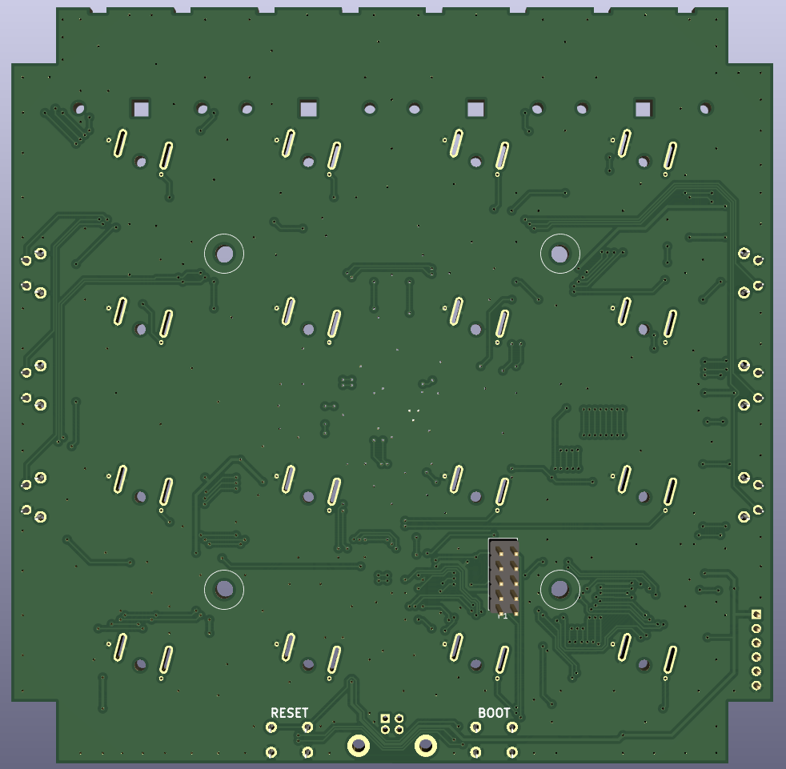

# Midi Fighter 3D Reverse Engineering
This repo holds the reverse engineered schematics and PCB design that should hopefully be functionally identical to the DJTechTools Midi Fighter 3D. This was done in the effort of creating functional firmware for the MF3D, as DJTechTools has shared or open sourced every Midi Fighter firmware except for MF3D.

The repository requires KiCAD v7.

However, there are also some components that I am not very certain about, which I hope would be uncovered as time goes by. In specific, the list of items are:
* the model of the LEDs
  * 4 white LEDs for bank buttons on top
  * 32 non-addressable RGB LEDs for arcade buttons

## Other details
Here are some of the other details that I have noticed while performing the reverse engineering.
* The button and RGB LED footprints are angled at 15 degrees.
* The pull up resistors R11 and R12 has pads on the PCB but are missing from the actual product. Maybe the chip doesn't actually need them?
* The through hole tactile switches SW23 and SW24 are not installed in the actual product. Presumably you can mount them on either side of the PCB.
* Both pin headers are not installed in the actual product.
* D17 is a chip with 5 internal diodes, and D18-21 are missing in the schematic, so the diodes in the chip were probably individually numbered in the original design.
* Resistor networks R5-7 are probably [CTS Electronic Components 746X101103JP](https://www.digikey.com/en/products/detail/cts-resistor-products/746X101103JP/1118406).
* The arcade button footprint has a test pad on the pulled up side, but I did not include it in the recreated footprint.
* The mounting screws are probably M3 screws.

In an email exchange with DJTT, they have stated that the magnometer IST8308 has been replaced by accelerometer MMA8453Q, but [both of these chips are present](./img/i2c%20cluster.png) on my board. In addition, the circuitry around IST8308 (U11) does not seem to correspond to the application circuit given in its datasheet.

## Previews

