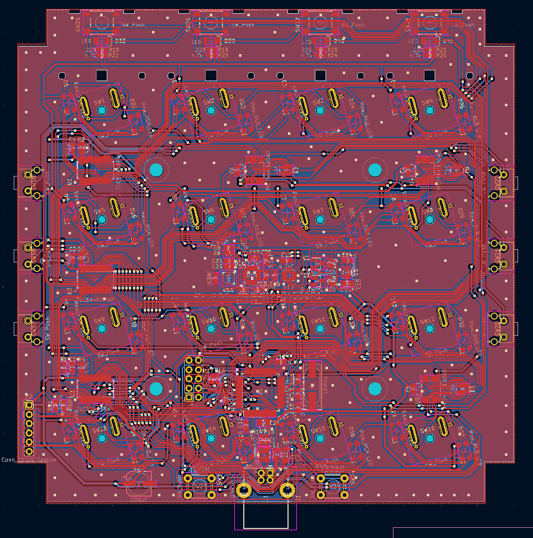

# Midi Fighter 3D Reverse Engineering
This repo holds the reverse engineered schematics and PCB design that should hopefully be functionally identical to the DJTechTools Midi Fighter 3D. This was done in the effort of creating functional firmware for the MF3D, as DJTechTools has shared or open sourced every Midi Fighter firmware except for MF3D.

However, there are also some components that I am not very certain about, which I hope would be uncovered as time goes by. In specific, the list of items are:
* the chip U11, marked `9470 008` ([link to image](./img/U11.jpg))
  * this chip is connected to the I2C bus on 3v3, might be I2C enabled
  * footprint QFN-16_3x3mm_P0.5mm
* the model of the LEDs
  * 4 white LEDs for bank buttons on top
  * 32 non-addressable RGB LEDs for arcade buttons
* the model of the resistor networks R5, R6 and R7
  * the footprint I chose in the design seems to have wider pins than the actual component footprint
* values of capacitors
  * most of the capacitor values that I included in the design are copied from the sample designs in the datasheets
* value of the inductor L2

## Other details
Here are some of the other details that I have noticed while performing the reverse engineering.
* The button and RGB LED footprints are angled at 15 degrees.
* The pull up resistors R11 and R12 has pads on the PCB but are missing from the actual product. Maybe the chip doesn't actually need them?
* The through hole tactile switches SW23 and SW24 are not installed in the actual product. Presumably you can mount them on either side of the PCB.
* Both pin headers are not installed in the actual product.
* D17 is a chip with 5 internal diodes, and D18-21 are missing in the schematic, so the diodes in the chip were probably individually numbered in the original design.
* The arcade button footprint has a test pad on the pulled up side, but I did not include it in the recreated footprint.
* The mounting screws are probably M3 screws.

## Previews

